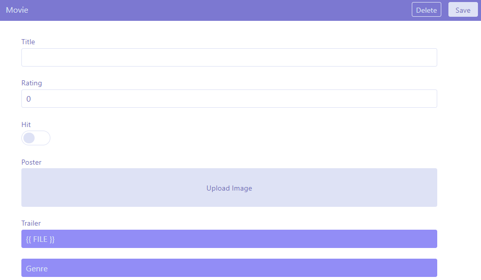
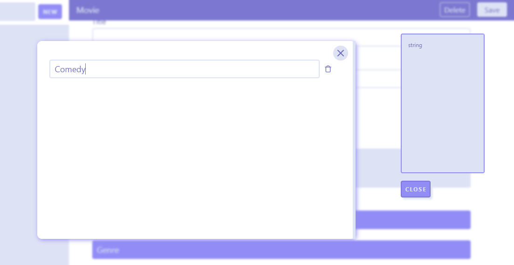

# Run

- Open the terminal and run `docker-compose build`.
- Once built, run `docker-compose up`.
- Client will start listening at port `3333` and server at port `4000`.

https://github.com/rahulrawat03/cms/assets/65608934/865452d5-2b21-466a-b706-cae91caaa75c

# About

This is a headless CMS with client tool to manage the content interactively.

### Document

Document is the top level item in the schema hierarchy.
Each `document` needs to have an identifier that references one of its `string` properties. This identifier is used to query the document.

```js
  {
    type: "<custom_type>",
    as: "document",
    identifier: "<referenced_property_name>",
    properties: [
      {
        type: "<value_type>", // string | number | image | file | <custom_type>
        name: "<property_name>"
      },
      ...
    ]
  }
```

### Object

Object is an item composed of other schema items providing the flexibility of creating nested structures.

```js
  {
    type: "<custom_type>",
    as: "object",
    properties: [
      {
        type: "<value_type>", // string | number | image | file | "<custom_type>"
        name: "<property_name>"
      },
      ...
    ]
  }
```

### Array

Array allows the addition of multiple schema items of pre-configured types in sequential fashion.

```js
  {
    type: "<custom_type>",
    as: "array",
    allowedTypes: [
      "<value_type_1>", // string | number | image | file | "<custom_type>"
      "<value_type_2>",
      ...
    ]
  }
```

`allowedTypes` property is required and specifies the type of schema items that can be put inside the array.

### Primitives

These are the basic types using which complex schema can be created.  
There are four of these foundation types :

- `string`
- `number`
- `image`
- `file`

# Example

Let's design the schema for a movie information service.

### Movie

Since the service is all about the movies, this will be core entity of our service.
A movie can have attributes like `title`, `rating`, `poster`, `trailer`, `genre`, `languages`, `actors`, `country` and many more. Let's concentrate on first four attributes for now.

```js
  {
    type: "movie",
    as: "document",
    identifier: "title",
    properties: [
      {
        name: "title",
        type: "string",
      },
      {
        name: "rating",
        type: "number",
      },
      {
        name: "poster",
        type: "image",
      },
      {
        name: "trailer",
        type: "file"
      },
    ],
  }
```

The schema defines a `document` of type `movie` and uses all the primitive types offered by the CMS for explanation.

This is how the schema looks right now in the client tool.


### Genre

A particular movie can belong to multiple genres and therefore `array` makes the most sense as a type for this attribute.

```js
  {
    type: "genre",
    as: "array",
    allowedTypes: ["string"]
  }
```

Once added in registry, `genre` can be used as any other type. Let's add it to the `movie` document.

```js
  {
    type: "movie",
    as: "document",
    identifier: "title",
    properties: [
      // ... previously added properties,
      {
        name: "genre",
        type: "genre",
      }
    ],
  }
```

Now the schema looks like this.  




### Actor

Actors are one of the most important attribute of a movie but `actor` entity itself can have much more to it apart from just a name. So, we cannot define an `actor` using one of our primitive types. This is where we make use of `object` to create a schema type specific to our use-case using the foundation types.

```js
  {
    type: "actor",
    as: "object",
    properties: [
      {
        name: "name",
        type: "string",
      },
      {
        name: "totalMovies",
        type: "number",
      },
      {
        name: "photo",
        type: "image",
      }
    ],
  }
```

After registering this type, we can use it inside our `movie` document. But a single movie can have multiple actors, so we should actually create an `array` for `actor`.

```js
  {
    type: "actors",
    as: "array",
    allowedTypes: ["actor"]
  }
```

Now, let's add the corresponding property to the document.

```js
  {
    type: "movie",
    as: "document",
    identifier: "title",
    properties: [
      // ... previously added properties,
      {
        name: "actors",
        type: "actors",
      }
    ],
  }
```

We can see the corresponding change on the client.  


